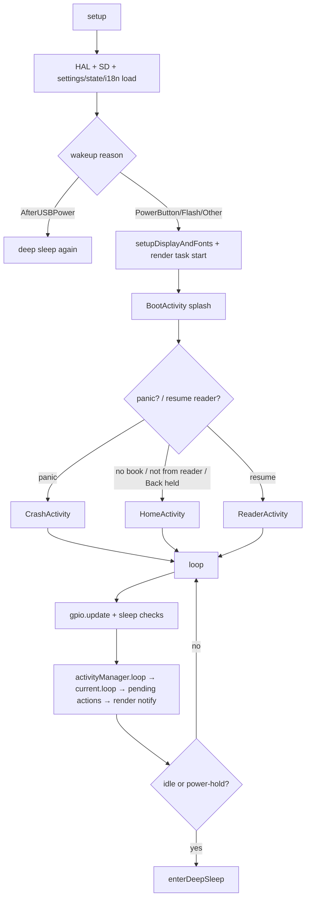
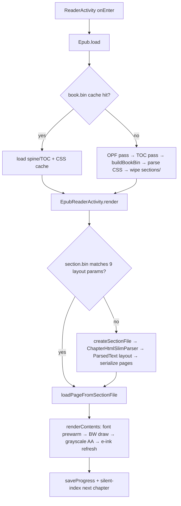

# DogeReader Firmware Index

A complete functional map of the firmware: what every subsystem does, where it lives, its key
classes/functions, and how the pieces connect. Use it to answer *"where do I go to change X?"* before
touching code.

- **On-disk project name:** CrossPoint (DogeReader is the fork/rename — most symbols, cache dirs and
  version macros still say `CrossPoint`/`crosspoint`).
- **Target:** Xteink X4 (and X3) — ESP32-C3, single-core RISC-V @160 MHz, ~380 KB RAM, no PSRAM, 16 MB
  flash, 800×480 (X4) / 792×528 (X3) e-ink.
- **Firmware version:** `1.2.0-Tarot` ([platformio.ini](../platformio.ini)).

**Companion docs**
- [.skills/SKILL.md](../.skills/SKILL.md) — coding standards, memory protocol, build/debug commands (read first).
- [docs/contributing/architecture.md](contributing/architecture.md) — narrative architecture overview.
- [docs/activity-manager.md](activity-manager.md) — the render-task / ActivityManager threading model.
- [docs/improvement-backlog.md](improvement-backlog.md) — TODOs, fragility and doc-drift found while indexing.
- [docs/file-formats.md](file-formats.md) — binary cache layouts (**version numbers stale — see backlog**).

> Line numbers are accurate as of the indexing pass and will drift as code changes. Treat them as
> "look near here," and grep the cited symbol if a link lands in the wrong place.

---

## 1. Subsystem map

| # | Subsystem | Root | What it owns |
|---|-----------|------|--------------|
| 1 | Core runtime & app framework | [src/main.cpp](../src/main.cpp), [src/activities/](../src/activities/) | Boot/loop/sleep, Activity lifecycle, ActivityManager, input mapping, settings/state stores |
| 2 | Reader engine & formats | [lib/Epub/](../lib/Epub/), [lib/Txt/](../lib/Txt/), [lib/Xtc/](../lib/Xtc/), [src/activities/reader/](../src/activities/reader/) | EPUB/TXT/XTC parsing, layout, pagination, hyphenation, caching, reading UI |
| 3 | Rendering & display | [lib/GfxRenderer/](../lib/GfxRenderer/), [lib/EpdFont/](../lib/EpdFont/), [open-x4-sdk/libs/display/](../open-x4-sdk/libs/display/), [src/components/](../src/components/) | Draw primitives, fonts, e-ink driver, themes/UITheme, image decode |
| 4 | UI activities | [src/activities/home/](../src/activities/home/), [settings/](../src/activities/settings/), [apps/](../src/activities/apps/), [tarot/](../src/activities/tarot/), [util/](../src/activities/util/) | Home/library, settings, stats apps, Tarot, keyboard/dialogs |
| 5 | Networking | [src/network/](../src/network/), [src/activities/network/](../src/activities/network/), [lib/KOReaderSync/](../lib/KOReaderSync/), [lib/OpdsParser/](../lib/OpdsParser/) | Web server, OTA, KOReader sync, OPDS/Calibre, WiFi |
| 6 | HAL, storage & support | [lib/hal/](../lib/hal/), [open-x4-sdk/libs/hardware/](../open-x4-sdk/libs/hardware/), [lib/I18n/](../lib/I18n/), [lib/Logging/](../lib/Logging/), [scripts/](../scripts/) | Hardware wrappers, SD I/O, serialization, i18n, logging, build |

---

## 2. Core runtime & application framework

### Entry point & lifecycle — [src/main.cpp](../src/main.cpp)

Declares all global singletons and fonts, runs the boot sequence and the Arduino main loop.

- **Globals:** `mappedInputManager`, `renderer` (GfxRenderer), `activityManager`, `fontDecompressor`,
  `fontCacheManager` ([main.cpp:30](../src/main.cpp#L30)); ~80 `EpdFont`/`EpdFontFamily` objects gated by
  `OMIT_FONTS` ([main.cpp:37-123](../src/main.cpp#L37-L123)).
- `setup()` ([main.cpp:227](../src/main.cpp#L227)) — HAL init → SD init (`Storage.begin()`, hard-fails to
  an error screen) → load settings/state/i18n/KOReader creds → wakeup-reason switch → `setupDisplayAndFonts()`
  → boot splash → route to Home or resume last book (boot-loop guarded via `readerActivityLoadCount`).
- `loop()` ([main.cpp:313](../src/main.cpp#L313)) — `gpio.update()` → sunlight fading fix → screenshot
  combo (Power+Down) → auto-sleep (idle ≥ `SETTINGS.getSleepTimeoutMs()`) / manual sleep (Power hold) →
  `activityManager.loop()` → tail delay policy (`yield()` when `skipLoopDelay()`, else `delay(10/50)`).
- `enterDeepSleep()` ([main.cpp:181](../src/main.cpp#L181)) — records `lastSleepFromReader`, saves state,
  renders the sleep screen synchronously, `display.deepSleep()`, `powerManager.startDeepSleep()`.

### Activity framework — [src/activities/](../src/activities/)

- **[Activity.h](../src/activities/Activity.h) / [Activity.cpp](../src/activities/Activity.cpp)** — base class for every
  screen. Contract: `onEnter()` / `loop()` / `render(RenderLock&&)` / `onExit()`. Query hooks read each
  frame: `skipLoopDelay()`, `preventAutoSleep()`, `isReaderActivity()`. Navigation API delegates to the
  manager: `startActivityForResult()`, `setResult()`, `finish()`, `requestUpdate(immediate)`,
  `requestUpdateAndWait()`. (`onGoHome`/`onSelectBook` are transitional shims marked *TODO: remove*,
  [Activity.h:57-60](../src/activities/Activity.h#L57-L60).)
- **[ActivityManager.h](../src/activities/ActivityManager.h) / [.cpp](../src/activities/ActivityManager.cpp)** —
  Android-style single-screen manager and the **only** owner of the shared FreeRTOS render task
  (8 KB stack) + render mutex. Holds `currentActivity`, an activity stack (`stackActivities`, reserve 10),
  and a deferred `pendingAction` (`Push`/`Pop`/`Replace`). Top-level `goTo*()` factories
  ([:169-208](../src/activities/ActivityManager.cpp#L169-L208)) build+enter each screen. `renderTaskLoop()`
  blocks on `ulTaskNotifyTake`, renders under a `RenderLock` + `HalPowerManager::Lock`. Pop-to-empty falls
  back to `goHome()`.
- **[ActivityResult.h](../src/activities/ActivityResult.h)** — typed result payloads (`WifiResult`,
  `KeyboardResult`, `ChapterResult`, `PercentResult`, `SyncResult`, …) in a `std::variant`; the
  parent-return channel for `startActivityForResult`.
- **[RenderLock.h](../src/activities/RenderLock.h)** — RAII wrapper around the manager's `renderingMutex`
  (implementation in ActivityManager.cpp). Full threading rules in [activity-manager.md](activity-manager.md).
- **Boot/sleep screens:** [BootActivity](../src/activities/boot_sleep/BootActivity.cpp) (splash),
  [SleepActivity](../src/activities/boot_sleep/SleepActivity.cpp) (default/custom/cover/bitmap/blank wallpaper
  modes dispatched on `SETTINGS.sleepScreen`).

#### Boot → loop → sleep (control flow)



### Input mapping — [src/MappedInputManager.cpp](../src/MappedInputManager.cpp)

Translates **logical** buttons (`Button::{Back,Confirm,Left,Right,Up,Down,Power,PageBack,PageForward}`) to
**physical** GPIO. Front buttons follow `SETTINGS.frontButton*` (user-remappable, must be a unique
permutation); Up/Down/Power are fixed; PageBack/PageForward pick a side layout from `kSideLayouts` via
`SETTINGS.sideButtonLayout`. `getPressedFrontButton()` bypasses remap for the remap-capture UI. Always use
these enums, never raw `HalGPIO::BTN_*`.

### Settings, state & stores — [src/](../src/)

| File | Singleton | Persists to | Notes |
|------|-----------|-------------|-------|
| [CrossPointSettings.cpp](../src/CrossPointSettings.cpp) + [SettingsList.h](../src/SettingsList.h) | `SETTINGS` | `/.crosspoint/settings.json` | All user prefs as enums; `getSettingsList()` drives both device + web settings UI |
| [CrossPointState.cpp](../src/CrossPointState.cpp) | `APP_STATE` | `/.crosspoint/state.json` | Open book path, recent-wallpaper ring, reader-crash guard, `lastSleepFromReader` |
| [JsonSettingsIO.cpp](../src/JsonSettingsIO.cpp) | — | (all of the above) | Central ArduinoJson (de)serialization; obfuscated secrets; legacy `.bin`→JSON migration |
| [RecentBooksStore.cpp](../src/RecentBooksStore.cpp) | `RECENT_BOOKS` | `/.crosspoint/recent.json` | MRU of 10 books w/ cover paths |
| [ReadingStatsStore.cpp](../src/ReadingStatsStore.cpp) | `READING_STATS` | `/stats/reading_stats.json` | Per-day/per-book minutes (streak logic is stubbed — see backlog) |
| [WifiCredentialStore.cpp](../src/WifiCredentialStore.cpp) | `WIFI_STORE` | `/.crosspoint/` (via JsonSettingsIO) | Up to 8 networks; loaded lazily, not at boot |

**Persistence model:** each store's `loadFromFile()` tries JSON first, else reads the legacy `*.bin`,
rewrites JSON, and renames the binary to `*.bak`. Binary readers are version-gated and clamp every field.
Secrets (WiFi/KOReader/OPDS passwords) are XOR-obfuscated with the device MAC + base64 (`*_obf` keys) —
**obfuscation, not encryption** ([ObfuscationUtils.h](../lib/Serialization/ObfuscationUtils.h)).

---

## 3. Reader engine & document formats

### EPUB core — [lib/Epub/](../lib/Epub/)

- **[Epub.cpp](../lib/Epub/Epub.cpp)** — top-level façade. `load(buildIfMissing, skipLoadingCss)`
  ([:337](../lib/Epub/Epub.cpp#L337)) is the master entry: try cache → OPF pass → TOC pass → `buildBookBin`
  → parse CSS. Cache dir = `.crosspoint/epub_<hash(filepath)>`. Also spine/TOC navigation,
  `calculateProgress()`, cover/thumb BMP generation.
- **[BookMetadataCache.cpp](../lib/Epub/Epub/BookMetadataCache.cpp)** — `book.bin` (spine order, TOC tree,
  cumulative byte sizes, metadata). **`BOOK_CACHE_VERSION = 5`** ([:12](../lib/Epub/Epub/BookMetadataCache.cpp#L12)).
  Streams to disk to bound RAM; builds an FNV-1a href index for books with ≥400 spine items (issue #134).
- **[Section.cpp](../lib/Epub/Epub/Section.cpp)** — per-chapter page cache
  `sections/<spineIndex>.bin`. **`SECTION_FILE_VERSION = 19`** ([:13](../lib/Epub/Epub/Section.cpp#L13)).
  The header's 9 layout params are the cache key; any mismatch wipes and rebuilds the section.
- **[ChapterHtmlSlimParser.cpp](../lib/Epub/Epub/parsers/ChapterHtmlSlimParser.cpp)** — the HTML→pages
  layout driver (expat streaming, 1 KB chunks). Handles inline styles, blocks, tables→cells, images
  (extract + aspect-fit), footnote links, anchors, and page flushing.
- **[ParsedText.cpp](../lib/Epub/Epub/ParsedText.cpp)** — line-breaking & justification.
  `computeLineBreaks()` is a Knuth-style DP minimizing squared trailing space;
  `computeHyphenatedLineBreaks()` + `hyphenateWordAtIndex()` add Liang hyphenation.
- **[css/CssParser.cpp](../lib/Epub/Epub/css/CssParser.cpp)** — lightweight selector parser
  (element / class / `element.class` / groups). **`CSS_CACHE_VERSION = 4`**. Many selector types
  unsupported (see backlog).
- **Parsers:** [ContainerParser](../lib/Epub/Epub/parsers/ContainerParser.cpp),
  [ContentOpfParser](../lib/Epub/Epub/parsers/ContentOpfParser.cpp),
  [TocNcxParser](../lib/Epub/Epub/parsers/TocNcxParser.cpp) (EPUB2),
  [TocNavParser](../lib/Epub/Epub/parsers/TocNavParser.cpp) (EPUB3).
- **Page model:** [Page.cpp](../lib/Epub/Epub/Page.cpp) (`PageLine`/`PageImage` elements + footnotes),
  [blocks/TextBlock.cpp](../lib/Epub/Epub/blocks/TextBlock.cpp), [blocks/ImageBlock.cpp](../lib/Epub/Epub/blocks/ImageBlock.cpp).
- **Hyphenation:** [hyphenation/Hyphenator.cpp](../lib/Epub/Epub/hyphenation/Hyphenator.cpp) (Liang/TeX over
  flash tries), [LanguageRegistry.cpp](../lib/Epub/Epub/hyphenation/LanguageRegistry.cpp) (7 languages:
  en/fr/de/ru/es/it/uk), generated `generated/hyph-*.trie.h`. Format: [hyphenation-trie-format.md](hyphenation-trie-format.md).

#### EPUB open → render (data flow)



### Other formats

- **TXT** — [lib/Txt/Txt.cpp](../lib/Txt/Txt.cpp) is just a file handle; pagination lives in
  [TxtReaderActivity.cpp](../src/activities/reader/TxtReaderActivity.cpp) (word-wrap into fixed line count,
  `index.bin` magic `TXTI`, `CACHE_VERSION = 2`).
- **XTC/XTCH** — [lib/Xtc/](../lib/Xtc/) native pre-rendered bitmap format (1-bit or 2-bit two-plane
  grayscale). [XtcReaderActivity.cpp](../src/activities/reader/XtcReaderActivity.cpp) blits pages directly —
  no layout. Format defs in [XtcTypes.h](../lib/Xtc/Xtc/XtcTypes.h).

### Reader activities — [src/activities/reader/](../src/activities/reader/)

[ReaderActivity](../src/activities/reader/ReaderActivity.cpp) dispatches by extension to
[EpubReaderActivity](../src/activities/reader/EpubReaderActivity.cpp) (the main reading loop: navigation,
footnotes with a depth-3 position stack, percent jumps, reflow on settings change, KOReader sync),
[TxtReaderActivity](../src/activities/reader/TxtReaderActivity.cpp), or
[XtcReaderActivity](../src/activities/reader/XtcReaderActivity.cpp). Supporting sub-activities: chapter/percent/
footnote selection, [EpubReaderMenuActivity](../src/activities/reader/EpubReaderMenuActivity.cpp),
[KOReaderSyncActivity](../src/activities/reader/KOReaderSyncActivity.cpp),
[QrDisplayActivity](../src/activities/reader/QrDisplayActivity.cpp). Shared helpers in
[ReaderUtils.h](../src/activities/reader/ReaderUtils.h) (orientation, page-turn detection, full-refresh cadence,
templated grayscale AA).

### Caching model (all formats)

| Cache | Path | Version | Invalidated by |
|-------|------|---------|----------------|
| Book metadata | `epub_<hash>/book.bin` | `BOOK_CACHE_VERSION=5` | version only |
| CSS rules | `epub_<hash>/…` | `CSS_CACHE_VERSION=4` | version → wipes `sections/` |
| Chapter pages | `epub_<hash>/sections/<n>.bin` | `SECTION_FILE_VERSION=19` | fontId, lineCompression, paragraphSpacing, alignment, viewport W/H, hyphenation, embeddedStyle, imageRendering |
| EPUB progress | `epub_<hash>/progress.bin` | (4/6-byte, no magic) | — |
| TXT index | `txt_<hash>/index.bin` | `TXTI` v2 | fileSize, viewportW, linesPerPage, fontId, margin, alignment |
| XTC/TXT progress | `<fmt>_<hash>/progress.bin` | (raw) | — |

Cache keys are `std::hash<std::string>(filepath)` — **moving/renaming a book loses progress**. Clear via the
reader menu "Delete Cache" or [ClearCacheActivity](../src/activities/settings/ClearCacheActivity.cpp).

---

## 4. Rendering & display

### GfxRenderer — [lib/GfxRenderer/GfxRenderer.cpp](../lib/GfxRenderer/GfxRenderer.cpp)

The logical drawing API over the panel framebuffer. Everything bottoms out at `drawPixel()`
([:173](../lib/GfxRenderer/GfxRenderer.cpp#L173)), which maps logical→physical via `rotateCoordinates()`
(the 4-orientation transform, [:43-73](../lib/GfxRenderer/GfxRenderer.cpp#L43-L73)) and flips one bit.

- **Primitives:** lines/rects/rounded-rects/arcs/polygons, `fillRectDither` (4-level dither via
  `Color{Clear,White,LightGray,DarkGray,Black}`).
- **Text:** `drawText`/`drawCenteredText`/`drawTextRotated90CW` → templated `renderCharImpl` (2-bit vs 1-bit
  glyph decode). Measurement (`getTextWidth`, `getTextAdvanceX`, kerning) uses fixed-point `fp4` with
  differential rounding so layout matches rendering. `wrappedText`/`truncatedText` for UI.
- **Images/bitmaps:** `drawImage`/`drawIcon` (fast native path when orientation is `LandscapeCounterClockwise`),
  `drawBitmap` (2-bit, scaling/crop), `drawBitmap1Bit`.
- **Grayscale (single-buffer mode):** `storeBwBuffer()` copies the framebuffer into 8 KB malloc chunks;
  `restoreBwBuffer()` restores it. Required because grayscale LSB/MSB passes destroy the BW framebuffer.
- **Screen:** `getScreenWidth/Height` (orientation-swapped), `getOrientedViewableTRBL` (bezel margins),
  `displayBuffer(refreshMode)` → HAL.

Supporting: [Bitmap.cpp](../lib/GfxRenderer/Bitmap.cpp) (streaming BMP reader + dithering),
[BitmapHelpers.cpp](../lib/GfxRenderer/BitmapHelpers.cpp) (Atkinson/Floyd-Steinberg ditherers tuned to the X4),
[FontCacheManager.cpp](../lib/GfxRenderer/FontCacheManager.cpp) (two-pass "scan then prewarm" glyph cache).

### Fonts — [lib/EpdFont/](../lib/EpdFont/)

epdiy-derived bitmap font engine. [EpdFontData.h](../lib/EpdFont/EpdFontData.h) defines glyphs, kerning class
tables, ligatures, combining-mark positioning, and DEFLATE-compressed glyph groups.
[FontDecompressor.cpp](../lib/EpdFont/FontDecompressor.cpp) inflates only the needed groups (prewarmed per page).
Built-in families: **Bookerly** (12–18), **NotoSans** (8, 12–18), **OpenDyslexic** (8–14), **Ubuntu** (10/12 UI).
IDs are compile-time hashes in [src/fontIds.h](../src/fontIds.h), registered in `main.cpp`.

### E-ink driver — [open-x4-sdk/libs/display/EInkDisplay/](../open-x4-sdk/libs/display/EInkDisplay/)

SSD1677-class driver. `RefreshMode {FULL, HALF, FAST}`. Supports X4 (800×480) and X3 (792×528, differential
fast-refresh with retained previous frame). `displayBuffer(mode)` is the central refresh dispatcher; ghosting
is managed by a periodic full-refresh cadence (`ReaderUtils::displayWithRefreshCycle`, driven by
`SETTINGS.getRefreshFrequency()`). Custom grayscale LUTs live in `EInkDisplay.cpp`. Wrapped by
[lib/hal/HalDisplay.h](../lib/hal/HalDisplay.h).

### Themes & components — [src/components/](../src/components/)

`#define GUI UITheme::getInstance().getTheme()` — **all UI must draw through `GUI`** for orientation-aware
consistency. [BaseTheme.cpp](../src/components/themes/BaseTheme.cpp) (Classic) defines every component drawer
(header, list, battery, button hints, tab bar, popup, keyboard key, status bar);
[lyra/LyraTheme.cpp](../src/components/themes/lyra/LyraTheme.cpp) is the default modern theme (+ a Lyra 3-cover
variant). 1-bit PROGMEM icons in [components/icons/](../src/components/icons/). Cover/tarot image decode via
[JpegToBmpConverter](../lib/JpegToBmpConverter/) / [PngToBmpConverter](../lib/PngToBmpConverter/).

---

## 5. UI activities

### Navigation graph

```
Boot → (panic?) CrashActivity → Home
Home ─ Browse   → FileBrowser → Reader / BmpViewer ; → ConfirmationActivity (delete)
     ─ Recents  → RecentBooks → Reader
     ─ Transfer → CrossPointWebServer            (network)
     ─ Apps     → Apps ─ Tarot        → Tarot (DrawPrompt ↔ Main ↔ HistoryGrid)
     │               └─ Reading Stats → ReadingStats ─ Confirm → ReadingHeatmap
     │                                              └─ Down    → ReadingProfile
     ─ Settings → Settings (tabs: Display/Reader/Controls/System)
     │               → ButtonRemap / StatusBarSettings / ClearCache / LanguageSelect
     │               → KOReaderSettings → KeyboardEntry / KOReaderAuth → WifiSelection
     │               → CalibreSettings  → KeyboardEntry
     │               → WifiSelection / OtaUpdate → WifiSelection
     ─ (OPDS)   → OpdsBookBrowser → WifiSelection ; → KeyboardEntry (search) ; → Reader
```

Utility activities ([KeyboardEntryActivity](../src/activities/util/KeyboardEntryActivity.cpp),
[ConfirmationActivity](../src/activities/util/ConfirmationActivity.cpp),
[FullScreenMessageActivity](../src/activities/util/FullScreenMessageActivity.cpp),
[BmpViewerActivity](../src/activities/util/BmpViewerActivity.cpp)) are launched via `startActivityForResult`
and return an `ActivityResult`.

### Home & library — [src/activities/home/](../src/activities/home/)

- **[HomeActivity](../src/activities/home/HomeActivity.cpp)** — launcher: "continue reading" cover strip +
  data-driven shortcut menu (from [util/ShortcutRegistry.cpp](../src/util/ShortcutRegistry.cpp): Browse,
  Recents, Transfer, Apps, Settings, Stats*). Lazy cover-thumbnail generation; framebuffer store/restore trick
  to redraw the cover cheaply.
- **[FileBrowserActivity](../src/activities/home/FileBrowserActivity.cpp)** — SD browser, natural sort,
  long-press-Confirm delete, long-press-Back to root.
- **[RecentBooksActivity](../src/activities/home/RecentBooksActivity.cpp)**,
  **[AppsActivity](../src/activities/home/AppsActivity.cpp)** (Tarot + Reading Stats; Heatmap entry exists but is
  unwired), **[CrashActivity](../src/activities/home/CrashActivity.cpp)** (renders the saved panic report).

### Settings — [src/activities/settings/](../src/activities/settings/)

[SettingsActivity](../src/activities/settings/SettingsActivity.cpp) is a 4-tab menu (Display / Reader /
Controls / System) built from the shared `getSettingsList()` plus device-only ACTION rows that launch:
[ButtonRemap](../src/activities/settings/ButtonRemapActivity.cpp),
[StatusBarSettings](../src/activities/settings/StatusBarSettingsActivity.cpp),
[LanguageSelect](../src/activities/settings/LanguageSelectActivity.cpp),
[ClearCache](../src/activities/settings/ClearCacheActivity.cpp),
[OtaUpdate](../src/activities/settings/OtaUpdateActivity.cpp),
[CalibreSettings](../src/activities/settings/CalibreSettingsActivity.cpp),
[KOReaderSettings](../src/activities/settings/KOReaderSettingsActivity.cpp) →
[KOReaderAuth](../src/activities/settings/KOReaderAuthActivity.cpp). `getSettingsList()` in
[SettingsList.h](../src/SettingsList.h) is the single source of truth shared by the device *and* web UIs.

### Apps — [src/activities/apps/](../src/activities/apps/)

Reading dashboards driven by `READING_STATS`:
[ReadingStatsActivity](../src/activities/apps/ReadingStatsActivity.cpp) (streak/goal/total boxes + book list),
[ReadingHeatmapActivity](../src/activities/apps/ReadingHeatmapActivity.cpp) (GitHub-style monthly calendar),
[ReadingProfileActivity](../src/activities/apps/ReadingProfileActivity.cpp) (5-axis radar). **Several metrics
here are stubbed/simplified — see backlog.**

### Tarot — [src/activities/tarot/](../src/activities/tarot/)

Three-part: [TarotActivity](../src/activities/tarot/TarotActivity.cpp) (UI/state: DrawPrompt/Main/HistoryGrid,
FAST_REFRESH to avoid blink), [TarotDeck](../src/activities/tarot/TarotDeck.cpp) (78-card Fisher-Yates shuffle
via `esp_random()`), [TarotAssets](../src/activities/tarot/TarotAssets.cpp) (loads `/tarot/meanings.json` +
BMP paths). Session history is in-memory only.

### Reusable UI patterns — [src/activities/util/](../src/activities/util/)

[KeyboardEntryActivity](../src/activities/util/KeyboardEntryActivity.cpp) is the universal text-input widget
(ABC/symbol layouts, URL snippets, password mode, cursor editing) returning `KeyboardResult`. Used by Calibre,
KOReader and OPDS search flows.

---

## 6. Networking

> **Security note up front:** the web server has **no authentication**, the AP is an **open network**, and
> **TLS is never validated** (all clients use `setInsecure()` / skip cert checks). See backlog before shipping
> network changes.

### Web server — [src/network/CrossPointWebServer.cpp](../src/network/CrossPointWebServer.cpp)

HTTP (:80) + WebSocket (:81) + UDP discovery (:8134). Serves gzip-compressed generated HTML pages and a
JSON/file API. Full WebDAV surface via [WebDAVHandler](../src/network/WebDAVHandler.cpp).

| Method | Path | Purpose |
|--------|------|---------|
| GET | `/`, `/files`, `/settings` | Pages (gzip) |
| GET | `/api/status` | version/ip/mode/rssi/heap/uptime |
| GET | `/api/files` | Streamed dir JSON |
| GET | `/api/settings` / POST `/api/settings` | Read / apply settings |
| GET | `/download` | Stream a file |
| POST | `/upload`, `/mkdir`, `/rename`, `/move`, `/delete` | File ops (`/delete` accepts JSON `paths[]`) |
| WS | `START:name:size:path` → `READY` → binary chunks → `PROGRESS`/`DONE` | Fast upload |

Served in **STA** (join WiFi, mDNS `crosspoint.local`) or **AP** (open `CrossPoint-Reader` hotspot, captive
portal). Web-server activities override `preventAutoSleep()`/`skipLoopDelay()` and run tight `handleClient()`
loops with periodic watchdog resets. **Docs [webserver.md](webserver.md)/[webserver-endpoints.md](webserver-endpoints.md)
omit `/download`, `/rename`, `/move`, `/settings`, WebDAV and UDP discovery — see backlog.**

### Other network modules

- **OTA** — [OtaUpdater.cpp](../src/network/OtaUpdater.cpp): GitHub-release check (`checkForUpdate` →
  `isUpdateNewer` semver → `installUpdate` via `esp_https_ota`); restart done by
  [OtaUpdateActivity](../src/activities/settings/OtaUpdateActivity.cpp).
- **Downloads** — [HttpDownloader.cpp](../src/network/HttpDownloader.cpp) (fetch-to-stream / to-SD, Basic auth
  from OPDS settings).
- **KOReader sync** — [lib/KOReaderSync/](../lib/KOReaderSync/): `KOReaderSyncClient` (kosync API,
  `x-auth-user`/`x-auth-key`=MD5(pw) + Basic), `KOReaderDocumentId` (filename or partial-content MD5),
  `ProgressMapper` (percentage-based ↔ `(spineIndex,page)`), `KOReaderCredentialStore`. Driven by
  [KOReaderSyncActivity](../src/activities/reader/KOReaderSyncActivity.cpp) (NTP → hash → fetch → conflict resolve).
- **OPDS/Calibre** — [lib/OpdsParser/](../lib/OpdsParser/) (expat streaming Atom parser),
  [OpdsBookBrowserActivity](../src/activities/browser/OpdsBookBrowserActivity.cpp) (browse/search/download),
  [CalibreConnectActivity](../src/activities/network/CalibreConnectActivity.cpp) (reuses the web server for
  wireless push). Config in [CalibreSettingsActivity](../src/activities/settings/CalibreSettingsActivity.cpp).
- **WiFi** — [WifiSelectionActivity](../src/activities/network/WifiSelectionActivity.cpp) +
  [WifiCredentialStore](../src/WifiCredentialStore.cpp).

---

## 7. HAL, storage & support libraries

### HAL — [lib/hal/](../lib/hal/)

**Always use HAL classes, never the SDK directly.**

| HAL class | Wraps | Singleton | Purpose |
|-----------|-------|-----------|---------|
| [HalDisplay](../lib/hal/HalDisplay.h) | `EInkDisplay` | `display` | Framebuffer + refresh, grayscale, deep sleep, X3/X4 mode |
| [HalGPIO](../lib/hal/HalGPIO.h) | `InputManager` | `gpio` | Buttons, SPI, USB detect, wakeup reason, **runtime X3/X4 fingerprinting** (I2C probe + NVS cache) |
| [HalStorage](../lib/hal/HalStorage.h) | `SDCardManager`→SdFat | `Storage` | Mutex-guarded SD I/O; `HalFile` aliased as `FsFile` |
| [HalPowerManager](../lib/hal/HalPowerManager.h) | `BatteryMonitor` + I2C fuel gauge | `powerManager` | CPU scaling (10 MHz idle), battery %, deep sleep (GPIO13 latch) |
| [HalSystem](../lib/hal/HalSystem.h) | ESP-IDF panic hooks | namespace | Panic capture → `/crash_report.txt` |

Low-level SDK: [open-x4-sdk/libs/hardware/](../open-x4-sdk/libs/hardware/) (BatteryMonitor ADC gauge,
InputManager ADC-multiplexed buttons, SDCardManager). Note `SDCardManager::readFile` silently caps at 50 KB —
use streaming variants for larger files.

### Support libraries — [lib/](../lib/)

- **Storage/paths:** [FsHelpers](../lib/FsHelpers/FsHelpers.cpp) (path normalization + extension checks),
  [Serialization.h](../lib/Serialization/Serialization.h) (POD/string binary read-write over `FsFile` — the
  cache layer), [ObfuscationUtils](../lib/Serialization/ObfuscationUtils.cpp) (XOR+MAC secret obfuscation).
- **i18n:** [lib/I18n/](../lib/I18n/) — `tr(STR_X)` macro; source YAMLs in
  [translations/](../lib/I18n/translations/) → generated `I18nKeys.h`/`I18nStrings.{h,cpp}` (22 languages,
  missing keys fall back to English). See [i18n.md](i18n.md).
- **Logging:** [Logging.h](../lib/Logging/Logging.h) — `LOG_ERR/INF/DBG(origin, fmt, …)`, level-gated, with an
  RTC-persisted 16-entry ring buffer surfaced in crash reports.
- **Text:** [Utf8](../lib/Utf8/Utf8.cpp) (validated codepoint iteration + safe truncation).
- **Compression/zip:** [ZipFile](../lib/ZipFile/ZipFile.cpp), [InflateReader](../lib/InflateReader/InflateReader.cpp),
  [lib/uzlib/](../lib/uzlib/) (vendored DEFLATE), [lib/expat/](../lib/expat/) (vendored XML).

### Build system

- **[platformio.ini](../platformio.ini)** — board `esp32-c3-devkitm-1`, C++20, no exceptions/RTTI,
  single-buffer e-ink, panic `--wrap` hooks. Envs: `default` (dev, LOG 2), `gh_release` (LOG 1),
  `gh_release_rc`, `slim` (no serial).
- **Pre-build scripts (in order):** [build_html.py](../scripts/build_html.py) (HTML/JS → gzip `.generated.h`),
  [gen_i18n.py](../scripts/gen_i18n.py) (YAML → i18n headers), [git_branch.py](../scripts/git_branch.py)
  (version macro), [patch_jpegdec.py](../scripts/patch_jpegdec.py) (fixes a progressive-JPEG crash in the
  pinned JPEGDEC).
- **[partitions.csv](../partitions.csv)** — dual-OTA: 2× 6.25 MB app slots + 3.375 MB SPIFFS + coredump.
- **CI** — [.github/workflows/](../.github/workflows/): `ci.yml` (clang-format + cppcheck + build),
  `release.yml`, `release_candidate.yml`, `pr-formatting-check.yml` (conventional-commit PR titles).

**Generated files — never edit by hand:** `src/network/html/*.generated.h`, `lib/I18n/I18nKeys.h` &
`I18nStrings.{h,cpp}`, `src/fontIds.h`, `lib/Epub/Epub/hyphenation/generated/*.trie.h`.

---

## 8. Where to make common changes

| I want to… | Start here |
|------------|-----------|
| Add a new screen | Subclass [Activity](../src/activities/Activity.h); add a `goTo*` in [ActivityManager](../src/activities/ActivityManager.cpp); draw via `GUI` |
| Add/modify a user setting | [SettingsList.h](../src/SettingsList.h) + a field in [CrossPointSettings.h](../src/CrossPointSettings.h) (auto-wired to device + web UI) |
| Change EPUB layout/pagination | [ChapterHtmlSlimParser.cpp](../lib/Epub/Epub/parsers/ChapterHtmlSlimParser.cpp) + [ParsedText.cpp](../lib/Epub/Epub/ParsedText.cpp) — **bump `SECTION_FILE_VERSION`** |
| Change a cache's binary format | Bump its version constant, document in [file-formats.md](file-formats.md), test with `.crosspoint/` deleted |
| Add a drawing primitive / fix rendering | [GfxRenderer.cpp](../lib/GfxRenderer/GfxRenderer.cpp) |
| Restyle the UI | [themes/](../src/components/themes/) (Base = Classic, Lyra = default) — never hardcode fonts/colors |
| Add a web endpoint | [CrossPointWebServer.cpp](../src/network/CrossPointWebServer.cpp) + source HTML in `data/html/` |
| Add UI text | Add `STR_*` to [translations/english.yaml](../lib/I18n/translations/english.yaml), use `tr()` |
| Touch hardware | The relevant [lib/hal/](../lib/hal/) wrapper — never the SDK directly |

For the running list of known issues, stubs and doc drift, see
[docs/improvement-backlog.md](improvement-backlog.md).
